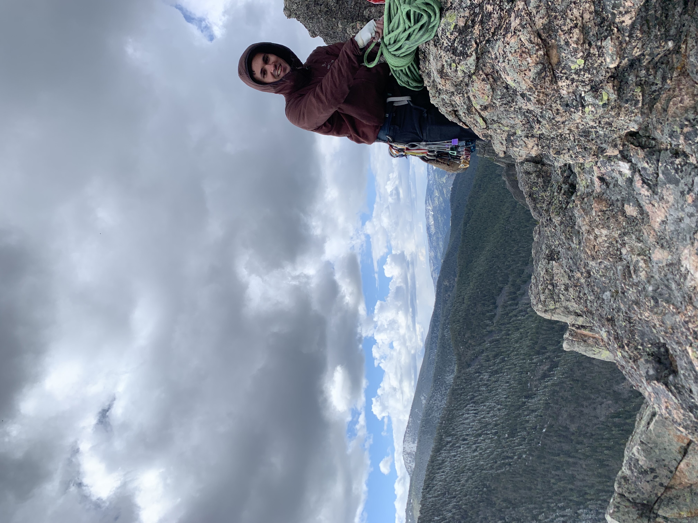
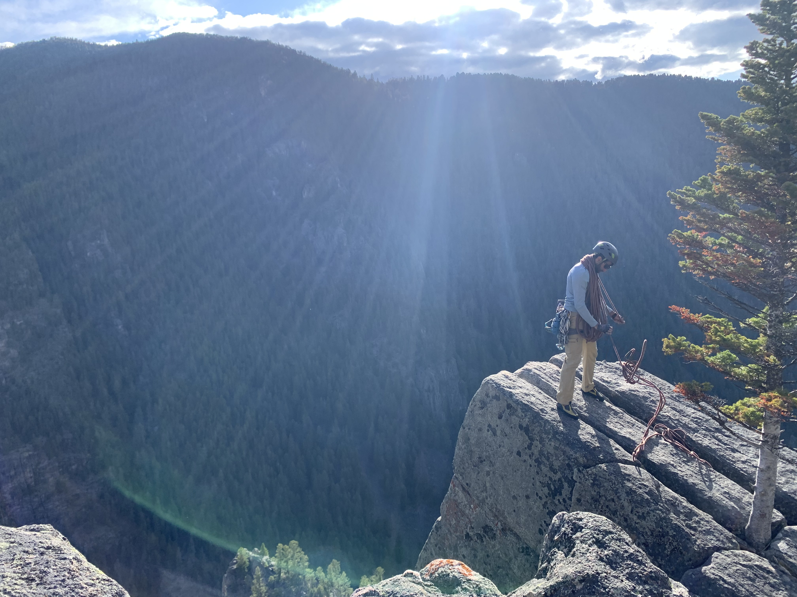
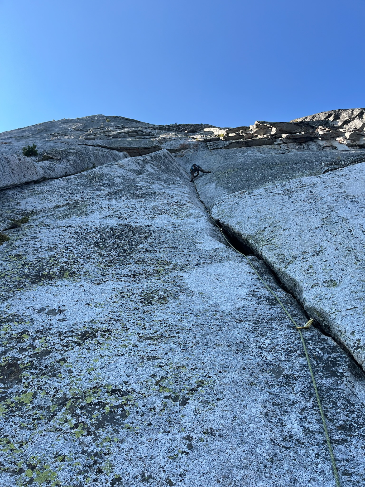
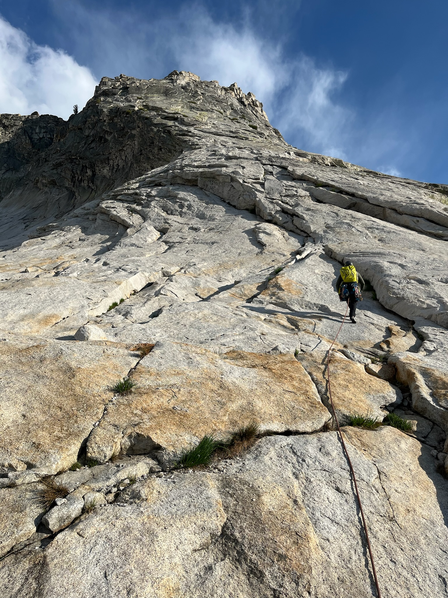
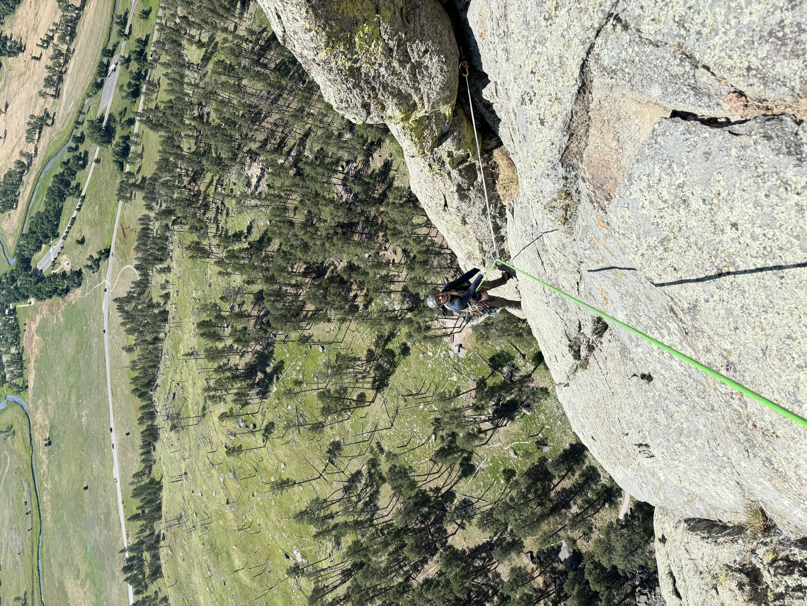
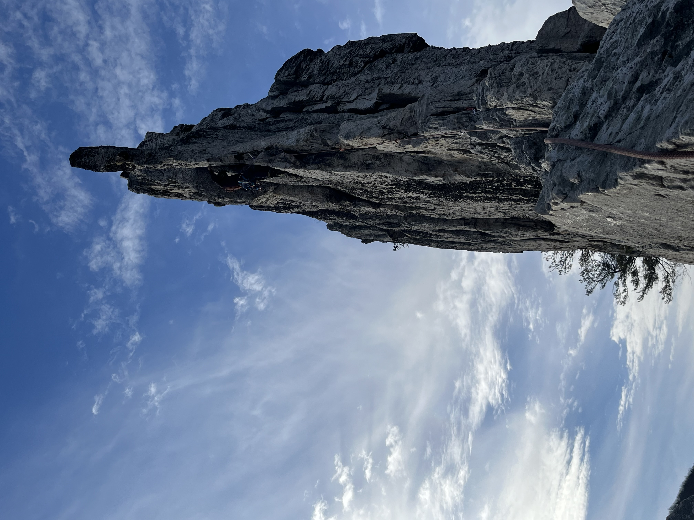
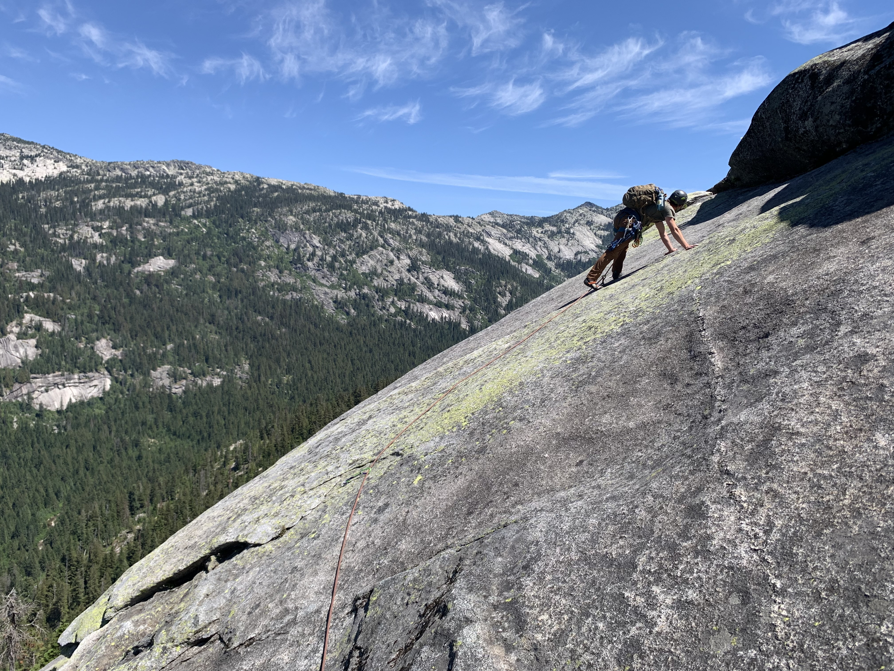

# Climbing

Outside of statistics, I spend a lot of time rock climbing, skiing, backpacking, and exploring mountain environments.

---

## Selected Adventures

::: {.climbing-grid}

::: {.climb-card}

**Gallatin Canyon, Montana**  
Skyline Arete, Spring 2026
:::

::: {.climb-card}

**Gallatin Canyon, Montana**  
Sparerib, Summer 2025
:::

::: {.climb-card}

**Fairview Dome, Yosemite National Park**  
The Regular Route, Summer 2024.
:::

::: {.climb-card}

**Tenaya Peak, Yosemite National Park**  
Northwest Buttress, Summer 2024.
:::

::: {.climb-card}

**Devils Tower, Wyoming**  
El Cracko Diablo, Summer 2024.
:::

::: {.climb-card}

**Seneca Rocks, West Virginia**  
Gunsight to South Peak Direct, Winter 2024.
:::

::: {.climb-card}

**Near Priest Lake, Idaho**  
The Lion King 5.9, Summer 2023.
:::

:::