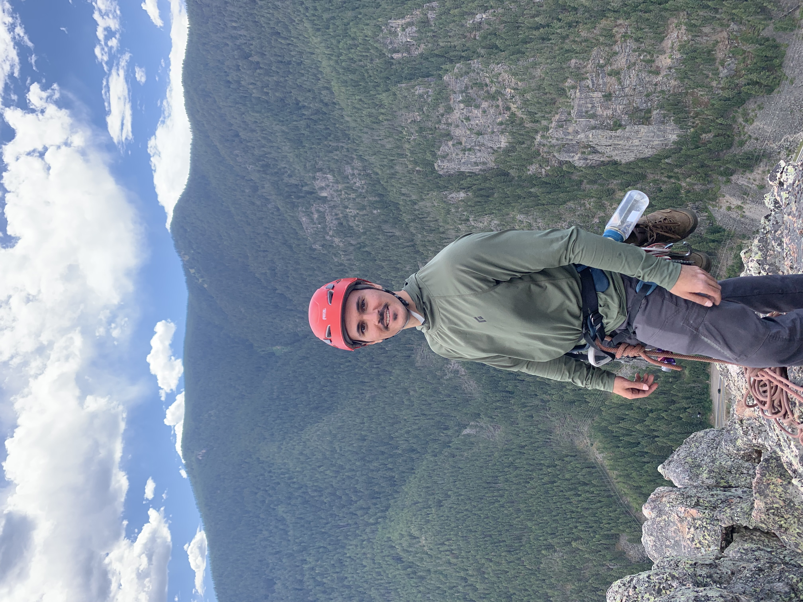

::: {.hero}
{.hero-img}

::: {.hero-text}
# Cole Cappello

PhD Student in Statistics  
University of Washington
:::
:::

---

# About Me:

My name is Cole Cappello, and I am starting my PhD in Statistics at the University of Washington - Seattle in the fall of 2026. I received a Bachelor's degree in Mathematics and Philosophy from Rutgers University in 2022, and recently completed a Master's in Statistics at Montana State University where I was advised by Dr. Andrew Hoegh.

Outside of Statistics, I am passionate about environmental conservation. I've completed two Americorps service terms--the first lasting 3 months with the Western Colorado Conservation Corps, and the second lasting 6 months with the Montana Conservation Corps.

I'm also an avid rock climber and enjoy learning about the gear and technical systems used for protection in alpine environments. See the Climbing page for some pictures from different adventures.

# Research:

Broadly speaking, my current research interests include:

- Spatiotemporal Statistics
- Bayesian Computation
- Stochastic Processes

During my Master's studies, I published a paper applying State-Space Modelling techniques to the phenomenon of tire degradation in Formula 1 racing. Feel free to check out the full paper on the publications page.

# Contact:
